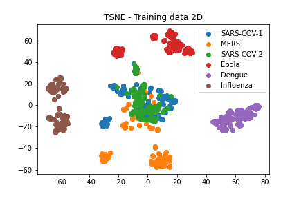

## EDIT 2023:
I decided to re-do this project but with a pretrained model (DNA-BERT) found at this repository: https://github.com/jerryji1993/DNABERT.
The experiemnts from the last year are in old_code folder now.

### Introduction
This project aims to classify the DNA sequences of six different pathogens including COVID-19. I compare the performance of Transformer networks and a simple Convolutional Neural Network as the baseline. The dataset includes a training set and five test sets, I experiment with full lengthed and median lengthed sequences and utilized the F1 score as my metric. 

### Dataset:
There are 6 classes of pathogens in this dataset: SARS-CoV-1, MERS-CoV, SARS-CoV-2 Ebola, Dengue, and Influenza. The dataset is gathered by the authors of the paper [1] and was available for download on their website. The dataset includes 18324 samples, the original paper has used only 1500 of this data for training, and the rest is divided into 5 test files. I will use the same number of samples for the training and test as the original paper. The dataset that is made available by the authors of [1] is in the CSV format and each CSV file includes the class number (1-6), class name, and the DNA sequence. 

#### Input data visualization:
I have used T-SNE and PCA methods to reduce the dimensionality of my data so I can visualize the training and validation data in a 2D space. As you can observe, the sequences related to SARS-COV-1, SARS-COV-2 and MERS seem to be more closely related to each other both in the T-SNE and PCA-produced figures. This is because these three pathogens are in the same genus Betacoronavirus, and we can see that it is reflected in the data as well. I think differentiating the mentioned three pathogens from each other would be the more challenging part of the classification task. The visualization of sequences in the validation set also demonstrates the same pattern, with the mentioned three pathogens being closer to each other and the other three being less closely related.

### Experimental settings:
I have used the TensorFlow framework for implementing the models in this work and the models are trained on an NVIDIA GTX 1080Ti GPU. Due to the limitation of resources, the batch size has been set to 4 and all models have been trained for 20 epochs. The global average pooling method has been used instead of flattening in all the models.

### Transformer settings:
The number of attention heads is set to 2 for the transformer models in my project. Due to the long length of the input sequences, I was not able to feed them directly to the transformer model, therefore I have used a convolution block that includes a conv1d layer and a max-pooling layer to reduce the dimensions of the input. I expeiment with 32, 64 and 128 conv filters for the transformers. The positional encoded embeddings are fed into the conv block and the result of the convolution is then passed on to the attention block. The results of the attention block are fed to a global average pooling layer and then to a feed-forward layer of 20 nodes before the final softmax layer.

### Results:
The baseline achieves a higher score when using full sequences, however,transformers work better when sequences are resized to the median length. When using the whole sequences, the baseline cangeneralize better than the more complex transformers models, however when we remove some of the data in resizing the seqeunces to the median length, transformer models work better. This project demonstrates that the biggest model doesn’t always yield the best result. Perhaps, it is better to always start with simpler models such as a simple CNN and then try more complex models like transformers. Additionally, it's good to remember that we can always benefit from CNNs as feature extractors. The input sequences are downsized by the scale of 4 due to the conv layers and the follow-up max-pooling layers, however, the attention heads can still learn the data well and achieve high scores on test files as well. 
The table below demonstrates the average accuracy of each model on all five test sets of the data. Individual score are available in results folders.

| Model  | Maximum Length Sequences |Median Length Seqeunces|
| ------------- | ------------- |------------- |
| Baseline CNN | **0.996**  | 0.906 |
| CNN_Transformer_32  | 0.985 | **0.986**  |
| CNN_Transformer_64   | 0.914 | 0.959|
| CNN_Transformer_128   | 0.950 | 0.896 |

### Refrences:
[1] Indrajit, Saha, et al. “COVID-DeepPredictor: Recurrent Neural Network to Predict SARS-CoV-2 and Other Pathogenic Viruses”, Journal of Frontiers in genetics, volume 12,83,2021
